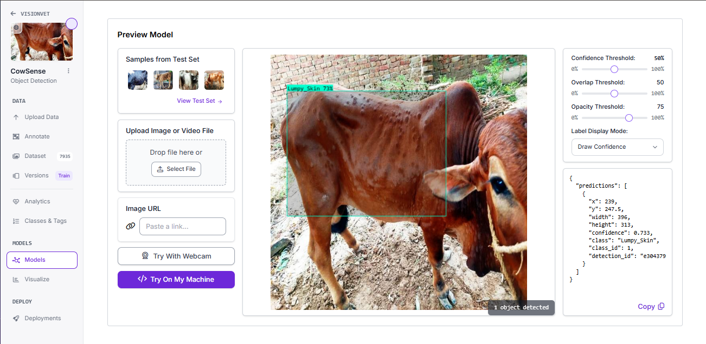
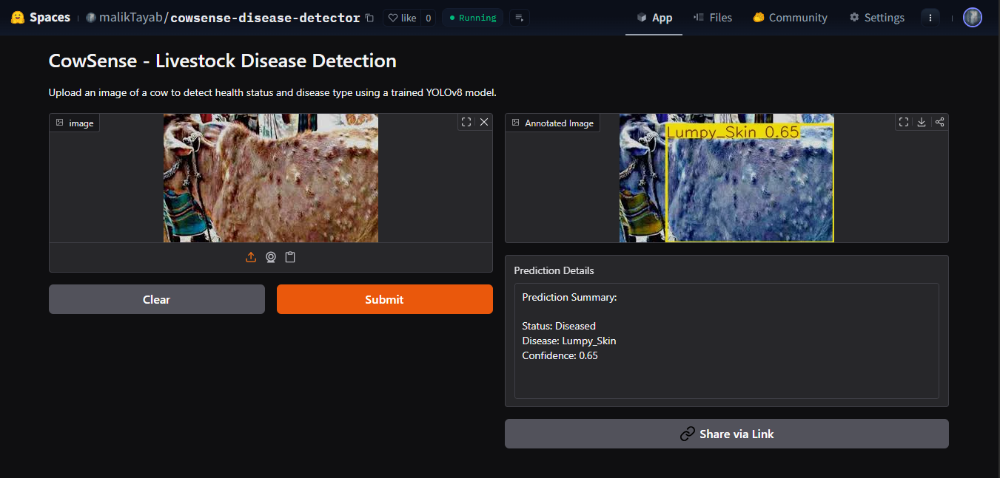
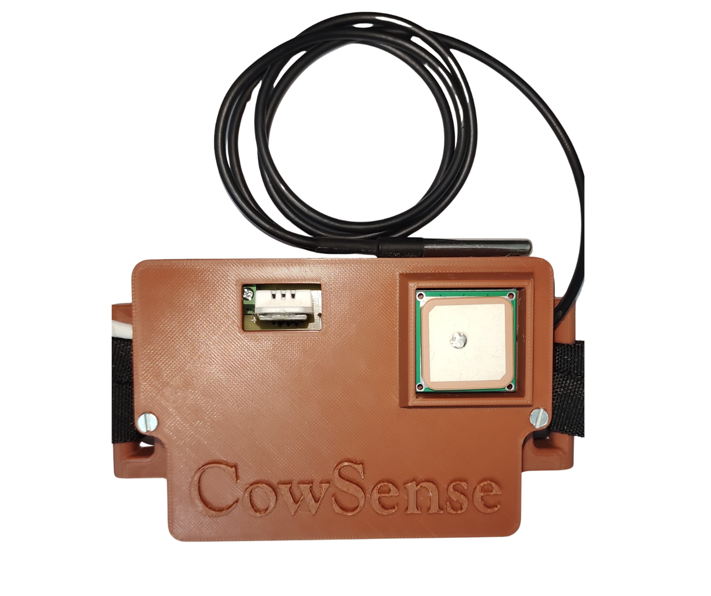
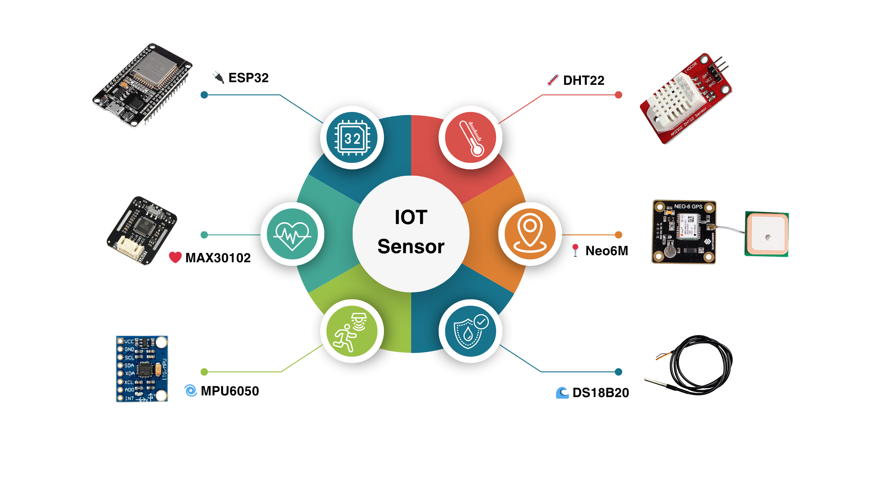

# 🐄 CowSense - AI-Powered Cattle Disease Detection System

Welcome to **CowSense**! 🚀  
An **AI + IoT powered smart livestock health management system** designed to monitor cattle vitals, detect diseases using computer vision, and streamline farmer-veterinarian interaction. 🧠📱🌾

---

## 📌 Table of Contents
- [✨ Key Features](#-key-features)
- [📱 Mobile Applications](#-mobile-applications)
- [📦 Tech Stack](#-tech-stack)
- [🧠 AI Model Details](#-ai-model-details)
- [🔗 Live Demo & Model Previews](#-live-demo--model-previews)
- [📡 IoT Device - CowLink](#-iot-device---cowlink)
- [📲 System Architecture](#-system-architecture)
- [🚀 Getting Started](#-getting-started)
- [🛠 Installation](#-installation)
- [📜 License](#-license)
- [🙋‍♂️ Maintainer](#-maintainer)

---

## ✨ Key Features

✅ AI-powered disease detection via image upload/live camera 📷  
✅ Annotated image reports with disease type & accuracy 💉📄  
✅ CowLink IoT collar with real-time vitals monitoring 📊  
✅ Alerts for abnormal readings 🚨  
✅ In-app vet consultation & appointment booking 🩺  
✅ Gemini AI support for farmers 🤖  
✅ Profile & animal management for both users 👤  
✅ Real-time chat between farmer and vet 💬

---

### 👨‍🌾 Farmer App
- 📊 Real-time vitals dashboard from CowLink
- 🖼️ Disease prediction via AI (image upload or camera)
- 🤖 Gemini AI assistant for disease guidance
- 💬 Chat with vets
- 📅 Appointment booking
- 🐄 Add/manage animal profiles

📥 **Download APK:** [Farmer App APK](https://drive.google.com/file/d/13L3j6xj8L-H2tU-wHV5MQAEHtr2T0EPz/view?usp=sharing)

---

### 🩺 Veterinarian (Vet) App
- 📋 View AI reports shared by farmers
- ✅ Accept/Reject appointments
- 🧾 Update consult status (Pending, Done, Rejected)
- 💊 Suggest medication
- 💬 Chat with farmers
- 👨‍⚕️ Manage profile

📥 **Download APK:** [Vet App APK](https://drive.google.com/file/d/1QAGQvaRya2WFgmAKeAmRa1rpj6i68pup/view?usp=sharing)

> 🔒 Both apps include secure login & registration flows.

---

## 📦 Tech Stack

| Layer        | Technology Used                     |
|--------------|-------------------------------------|
| Frontend     | Flutter (Farmer + Vet Apps)         |
| Backend      | Node.js + Express.js                |
| AI Model     | YOLOv8m (Trained on Google Colab)   |
| Dataset      | Roboflow Annotated Dataset          |
| Hosting/API  | Render, HuggingFace, Roboflow       |
| IoT Board    | ESP32 with sensors                  |
| DB           | Cloud-based MongoDB 🟢              |

---

## 🧠 AI Model Details

- 📸 Model Type: YOLOv8m Object Detection
- 🏷️ Annotated with: **Roboflow**
- 📍 Trained on: Google Colab (Python, Ultralytics)
- 🚀 Deployment: Hugging Face Space + Roboflow Space
- 🧪 Output: Annotated images, confidence score, disease label

#### 🔍 Model Capabilities:
- Detect visible diseases on cattle skin/body
- Annotate affected areas
- Generate report with disease name + accuracy

> 📚 The model is trained to **self-improve** by saving feedback & future annotations.

---

## 🔗 Live Demo & Model Previews

🔬 **Roboflow Preview**:  
👉 [Roboflow CowSense Model](https://app.roboflow.com/visionvet/cowsense/models/cowsense/1)

📸 **Sample Model Output**   


🤖 **Hugging Face AI Space**:  
👉 [Hugging Face Model Live Demo](https://huggingface.co/spaces/malikTayab/cowsense-disease-detector)

📸 **Sample Model Output**    


### 📲 App Demo Video

🎥 **Farmer App Demo**  
📺 [Watch](https://drive.google.com/file/d/1T_jcmVXzJbg_aFjyTw9QpchUqO88VYAx/view?usp=sharing)

---

## 📡 IoT Device - CowLink

🐄 **CowLink** is a custom-built smart collar worn by cattle. It collects vital health data and sends it to our backend server in real time.



### 🧰 Sensor Suite
- **ESP32** (Microcontroller)
- **DS18B20** – Body Temperature 🌡️
- **DHT22** – Environment Temp & Humidity 🌦️
- **MAX30102** – Heart Rate & SpO2 ❤️
- **MPU6050** – Motion, Rest & Activity 📈
- **GPS Module** – Real-time Location 🗺️

📤 Sensor data is transmitted to a **Node.js/Express.js server** hosted on **Render**, then shown in the farmer app.

🔔 Abnormal readings generate **instant alerts** to the farmer.

📟 *CowLink Device Sensors*  



---

## 📲 System Architecture

```mermaid
graph TD
A[Farmer App] -->|View Vitals & Upload Image| B(Server API)
VetApp[Veterinarian App] -->|View Reports & Consult| B
CowLink[IoT Collar] -->|Sensor Data| B
B -->|Store & Retrieve Data| DB[(MongoDB)]
B -->|Invoke AI Model| AIModel[YOLOv8m - Hugging Face]

````
## 🚀 Getting Started

Follow the steps below to set up the project locally:

1. **Clone the repository**
   ```bash
   git clone https://github.com/your-username/cowsense.git
   cd cowsense

2. **Navigate to the backend and install dependencies**

   ```bash
   cd backend
   npm install
   ```

3. **Install Flutter dependencies for both apps**

   ```bash
   # Farmer App
   cd ../farmer-app
   flutter pub get

   # Vet App
   cd ../vet-app
   flutter pub get
   ```

4. **Create environment file for backend**
   Inside the `backend` folder, create a `.env` file and add the following:

   ```env
   PORT=5000
   MONGO_URI=your_mongo_connection_string
   RENDER_API=https://your_render_server_url
   ```

5. **Run the backend server**

   ```bash
   cd backend
   npm run dev
   ```

6. **Run the apps**

   ```bash
   # Farmer App
   cd ../farmer-app
   flutter run

   # Vet App
   cd ../vet-app
   flutter run
   ```

---

## 🛠 Installation

> This project requires:
>
> * Node.js & npm
> * MongoDB
> * Flutter SDK
> * Android/iOS Emulator or Physical Device

**Note:** Make sure your environment is configured correctly to run both the backend and the Flutter apps. For Flutter setup, visit the [official Flutter docs](https://docs.flutter.dev/get-started/install).

---

## 📜 License

This project is licensed under the **MIT License**.

```
MIT License

Copyright (c) 2025 Tayab

Permission is hereby granted, free of charge, to any person obtaining a copy
of this software and associated documentation files (the "Software"), to deal
in the Software without restriction...
```

For more details, check the [LICENSE](LICENSE) file.

---

## 🙋‍♂️ Maintainer

Developed and maintained by:

👨‍💻 **Tayab Malik**
📧 Email: [tayabghafor@gmail.com](mailto:tayabghafor@gmail.com)
🔗 GitHub: [TayabGhafor](https://github.com/TayabGhafor)
🧠 Hugging Face: [CowSense Disease Detector](https://huggingface.co/spaces/malikTayab/cowsense-disease-detector)

> Feel free to connect, fork the repo, raise issues, or suggest features 🚀

---

```

---

Let me know if you'd like me to combine this with the earlier content and export the complete `README.md` as a downloadable file.
```
